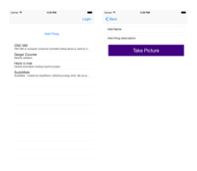

# SudoThing

Part of [SudoCare](https://sudoroom.org/wiki/SudoCare) an iOS Project for SudoRoom which will eventually be merged into the open source Labitrack SudoRoom [Inventory](https://sudoroom.org/wiki/Inventory) system.

This is an iOS App that lets you upload a SudoThing to the server.

* Update the wiki from phone: add comments for maintenance
* Hopefully add videos about how to use stuff, also draw instructions on how to use things as well using SudoPaint component of [SudoCare](https://sudoroom.org/wiki/SudoCare)
* Long-Term: then we can have people get little points for fixing SudoThings or learning about them or simply decorating them with art.

# Stuff

## Swift

Swift will be open sourced by the end of the year, so we should switched it from Obj-C to Swift by then.

## BackEnd

Temporarily put in parse as the back end, although FYI Parse is [Open Source](http://blog.parse.com/announcements/open-sourcing-our-sdks/) now.

This is for get stuff done speed, we will put everything in finality to Labitrack. Yee haw!